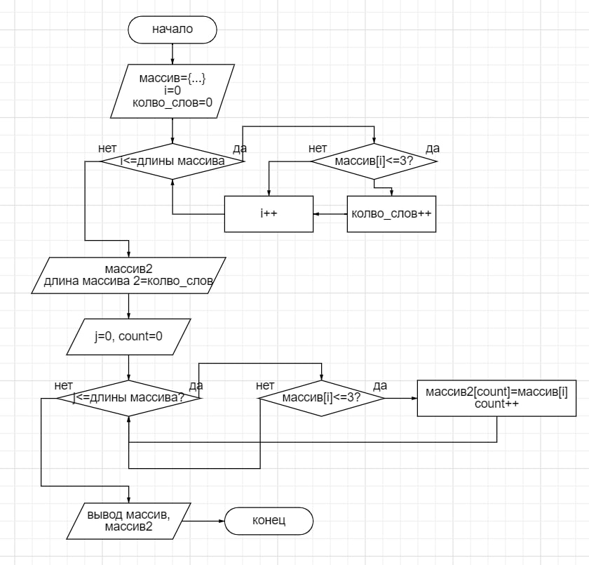

# Итоговая проверочная работа

## Описание программы
1. Первоначальный массив задан на старте выполнения программы
2. Находим количество слов, меньших или равных 3. Создаём массив соответсвующего размера
3. Заполнение массива 
4. Вывод первоначального и конечного массивов посредсвом функции

## Блок-схема алгоритма

